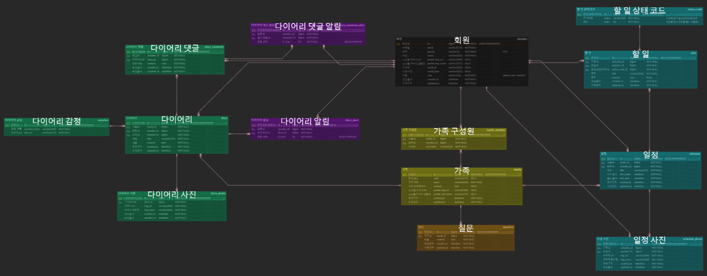

<div align="center">
  
</div>

<div align="center">
  <h1>zip</h1> 
  
  살아가면서 주변의 친구, 연인은 챙겼어도 
  
  가족에겐 소홀할 때가 많지 않았나요?

  ---
  
  친구,연인의 생일은 다 챙기면서 
  
  가족 행사는 옆으로 치워두고 있진 않았나요?

  ---

    가족들과 추억을 공유하고, 특별한 일을 함께 준비하고, 속마음을 공유할 수 있는 가족만을 위한 서비스

  --- 

</div>

<br>


## 👪 개발 멤버 소개

<table> 
<tr> 

<td height="150px" align="center"> <a href="https://github.com/gudtjr2949">  <br><br> 👑 이형석 <br>(FullStack) </a><br></td> 

<td height="150px" align="center"> <a href="https://github.com/choijehyuk">  <br><br> 😆 최제혁 <br>(BackEnd) </a> <br></td> 

<td height="150px" align="center"> <a href="https://github.com/hajin618">  <br><br> 😶 김하진 <br>(BackEnd) </a> <br></td> 

<td height="150px" align="center"> <a href="https://github.com/whddls12">  <br><br> 🙄 황종인 <br>(FrontEnd) </a> <br></td> 

<td height="150px" align="center"> <a href="https://github.com/euneuneunseok">  <br><br> 😠ì´ì€ì„ <br>(BackEnd) </a> <br></td> 

<td height="150px" align="center"> <a href="https://github.com/#">  <br><br> 🙂 이동현 <br>(Design) </a> <br></td> 

</tr> 
</table>

<br />

## 📆 프로젝트 기간

### 23.10.10. ~ 23.11.16

<br />

## 🗂️ 프로젝트 구성

<details>
<summary>FE 폴더 구조</summary>

```Plain Text
.
├── App.js
├── Gemfile
├── Gemfile.lock
├── __tests__
│   └── App-test.js
├── android
│   ├── app
│   │   ├── BUCK
│   │   ├── build.gradle
│   │   ├── build_defs.bzl
│   │   ├── debug.keystore
│   │   ├── proguard-rules.pro
│   │   └── src
│   │       ├── debug
│   │       │   ├── AndroidManifest.xml
│   │       │   └── java
│   │       │       └── com
│   │       │           └── zipapp
│   │       │               └── ReactNativeFlipper.java
│   │       └── main
│   │           ├── AndroidManifest.xml
│   │           ├── assets
│   │           │   ├── fonts
│   │           │   │   ├── Jost-Black.ttf
│   │           │   │   ├── Jost-BlackItalic.ttf
│   │           │   │   ├── Jost-Bold.ttf
│   │           │   │   ├── Jost-BoldItalic.ttf
│   │           │   │   ├── Jost-ExtraBold.ttf
│   │           │   │   ├── Jost-ExtraBoldItalic.ttf
│   │           │   │   ├── Jost-ExtraLight.ttf
│   │           │   │   ├── Jost-ExtraLightItalic.ttf
│   │           │   │   ├── Jost-Italic.ttf
│   │           │   │   ├── Jost-Light.ttf
│   │           │   │   ├── Jost-LightItalic.ttf
│   │           │   │   ├── Jost-Medium.ttf
│   │           │   │   ├── Jost-MediumItalic.ttf
│   │           │   │   ├── Jost-Regular.ttf
│   │           │   │   ├── Jost-SemiBold.ttf
│   │           │   │   ├── Jost-SemiBoldItalic.ttf
│   │           │   │   ├── Jost-Thin.ttf
│   │           │   │   ├── Jost-ThinItalic.ttf
│   │           │   │   ├── Pretendard-Black.otf
│   │           │   │   ├── Pretendard-Bold.otf
│   │           │   │   ├── Pretendard-ExtraBold.otf
│   │           │   │   ├── Pretendard-ExtraLight.otf
│   │           │   │   ├── Pretendard-Light.otf
│   │           │   │   ├── Pretendard-Medium.otf
│   │           │   │   ├── Pretendard-Regular.otf
│   │           │   │   ├── Pretendard-SemiBold.otf
│   │           │   │   └── Pretendard-Thin.otf
│   │           │   ├── fronts
│   │           │   │   ├── AntDesign.ttf
│   │           │   │   ├── Entypo.ttf
│   │           │   │   ├── EvilIcons.ttf
│   │           │   │   ├── Feather.ttf
│   │           │   │   ├── FontAwesome.ttf
│   │           │   │   ├── FontAwesome5_Brands.ttf
│   │           │   │   ├── FontAwesome5_Regular.ttf
│   │           │   │   ├── FontAwesome5_Solid.ttf
│   │           │   │   ├── FontAwesome6_Brands.ttf
│   │           │   │   ├── FontAwesome6_Regular.ttf
│   │           │   │   ├── FontAwesome6_Solid.ttf
│   │           │   │   ├── Fontisto.ttf
│   │           │   │   ├── Foundation.ttf
│   │           │   │   ├── Ionicons.ttf
│   │           │   │   ├── MaterialCommunityIcons.ttf
│   │           │   │   ├── MaterialIcons.ttf
│   │           │   │   ├── Octicons.ttf
│   │           │   │   ├── SimpleLineIcons.ttf
│   │           │   │   └── Zocial.ttf
│   │           │   └── index.android.bundle
│   │           ├── java
│   │           │   └── com
│   │           │       └── zipapp
│   │           │           ├── MainActivity.java
│   │           │           ├── MainApplication.java
│   │           │           └── newarchitecture
│   │           │               ├── MainApplicationReactNativeHost.java
│   │           │               ├── components
│   │           │               │   └── MainComponentsRegistry.java
│   │           │               └── modules
│   │           │                   └── MainApplicationTurboModuleManagerDelegate.java
│   │           ├── jni
│   │           │   ├── Android.mk
│   │           │   ├── MainApplicationModuleProvider.cpp
│   │           │   ├── MainApplicationModuleProvider.h
│   │           │   ├── MainApplicationTurboModuleManagerDelegate.cpp
│   │           │   ├── MainApplicationTurboModuleManagerDelegate.h
│   │           │   ├── MainComponentsRegistry.cpp
│   │           │   ├── MainComponentsRegistry.h
│   │           │   └── OnLoad.cpp
│   │           └── res
│   │               ├── drawable
│   │               │   └── rn_edit_text_material.xml
│   │               ├── mipmap-hdpi
│   │               │   ├── ic_launcher.png
│   │               │   ├── ic_launcher_adaptive_back.png
│   │               │   └── ic_launcher_round.png
│   │               ├── mipmap-mdpi
│   │               │   ├── ic_launcher.png
│   │               │   ├── ic_launcher_adaptive_back.png
│   │               │   └── ic_launcher_round.png
│   │               ├── mipmap-xhdpi
│   │               │   ├── ic_launcher.png
│   │               │   ├── ic_launcher_adaptive_back.png
│   │               │   └── ic_launcher_round.png
│   │               ├── mipmap-xxhdpi
│   │               │   ├── ic_launcher.png
│   │               │   ├── ic_launcher_adaptive_back.png
│   │               │   └── ic_launcher_round.png
│   │               ├── mipmap-xxxhdpi
│   │               │   ├── ic_launcher.png
│   │               │   ├── ic_launcher_adaptive_back.png
│   │               │   └── ic_launcher_round.png
│   │               └── values
│   │                   ├── strings.xml
│   │                   └── styles.xml
│   ├── build.gradle
│   ├── gradle
│   │   └── wrapper
│   │       ├── gradle-wrapper.jar
│   │       └── gradle-wrapper.properties
│   ├── gradle.properties
│   ├── gradlew
│   ├── gradlew.bat
│   ├── link-assets-manifest.json
│   └── settings.gradle
├── app.json
├── assets
│   ├── adaptive-icon.png
│   ├── background-image.png
│   ├── background.jpg
│   ├── camera.png
│   ├── emotion
│   │   ├── angry.png
│   │   ├── sad.png
│   │   ├── smile.png
│   │   └── wow.png
│   ├── family.png
│   ├── favicon.png
│   ├── fonts
│   │   ├── Jost-Black.ttf
│   │   ├── Jost-BlackItalic.ttf
│   │   ├── Jost-Bold.ttf
│   │   ├── Jost-BoldItalic.ttf
│   │   ├── Jost-ExtraBold.ttf
│   │   ├── Jost-ExtraBoldItalic.ttf
│   │   ├── Jost-ExtraLight.ttf
│   │   ├── Jost-ExtraLightItalic.ttf
│   │   ├── Jost-Italic.ttf
│   │   ├── Jost-Light.ttf
│   │   ├── Jost-LightItalic.ttf
│   │   ├── Jost-Medium.ttf
│   │   ├── Jost-MediumItalic.ttf
│   │   ├── Jost-Regular.ttf
│   │   ├── Jost-SemiBold.ttf
│   │   ├── Jost-SemiBoldItalic.ttf
│   │   ├── Jost-Thin.ttf
│   │   ├── Jost-ThinItalic.ttf
│   │   ├── Pretendard-Black.otf
│   │   ├── Pretendard-Bold.otf
│   │   ├── Pretendard-ExtraBold.otf
│   │   ├── Pretendard-ExtraLight.otf
│   │   ├── Pretendard-Light.otf
│   │   ├── Pretendard-Medium.otf
│   │   ├── Pretendard-Regular.otf
│   │   ├── Pretendard-SemiBold.otf
│   │   └── Pretendard-Thin.otf
│   ├── free-icon-kakao-talk-2111496.png
│   ├── free-icon-naver-11423248.png
│   ├── gallery.png
│   ├── geer.png
│   ├── icon.png
│   ├── pencil.png
│   ├── splash.png
│   ├── user.png
│   └── welcome.png
├── atoms
│   └── refreshState.js
├── babel.config.js
├── components
│   ├── diary
│   │   ├── DiaryCreate.js
│   │   ├── DiaryItem.js
│   │   ├── DiaryItemDetail.js
│   │   └── DiaryList.js
│   ├── notification
│   │   └── Notification.js
│   └── schedule
│       ├── ScheduleCreate.js
│       ├── ScheduleDetail.js
│       ├── ScheduleItem.js
│       ├── ScheduleList.js
│       ├── SchedulePreview.js
│       ├── ScheduleUpdate.js
│       ├── photo
│       │   └── PhotoList.js
│       └── plan
│           ├── PlanCreate.js
│           ├── PlanItem.js
│           └── PlanList.js
├── index.js
├── ios
│   ├── Podfile
│   ├── link-assets-manifest.json
│   ├── zipapp
│   │   ├── AppDelegate.h
│   │   ├── AppDelegate.mm
│   │   ├── Images.xcassets
│   │   │   ├── AppIcon.appiconset
│   │   │   │   └── Contents.json
│   │   │   └── Contents.json
│   │   ├── Info.plist
│   │   ├── LaunchScreen.storyboard
│   │   └── main.m
│   ├── zipapp.xcodeproj
│   │   ├── project.pbxproj
│   │   └── xcshareddata
│   │       └── xcschemes
│   │           └── zipapp.xcscheme
│   └── zipappTests
│       ├── Info.plist
│       └── zipappTests.m
├── metro.config.js
├── package-lock.json
├── package.json
├── react-native.config.js
├── screens
│   ├── CalendarScreen.js
│   ├── FamilyMainScreen.js
│   ├── HomeScreen.js
│   ├── IntroScreen.js
│   ├── MypageScreen.js
│   ├── ScheduleScreen.js
│   ├── album
│   │   └── AlbumScreen.js
│   ├── auth
│   │   ├── KakaoLoginCallBack.js
│   │   ├── KakaoLoginScreen.js
│   │   └── LoginScreen.js
│   ├── diary
│   │   └── DiaryScreen.js
│   ├── family
│   │   ├── FamilyInsertScreen.js
│   │   ├── FamilyInvitedScreen.js
│   │   ├── FamilySelectScreen.js
│   │   └── InputPhoneNumberScreen.js
│   └── navigation
│       └── StackNavigator.js
└── util
    ├── FileInterceptor.js
    └── Interceptor.js
```

</details>
<details>
<summary>BE 폴더 구조</summary>

```Plain Text
.
├── build
│   ├── classes
│   │   └── java
│   │       └── main
│   │           └── com
│   │               └── lastdance
│   │                   └── ziip
│   │                       ├── ZiipApplication.class
│   │                       ├── album
│   │                       │   ├── controller
│   │                       │   │   └── AlbumController.class
│   │                       │   ├── dto
│   │                       │   │   ├── request
│   │                       │   │   │   ├── AlbumMonthRequestDto$AlbumMonthRequestDtoBuilder.class
│   │                       │   │   │   └── AlbumMonthRequestDto.class
│   │                       │   │   └── response
│   │                       │   │       ├── AlbumDayResponseDto$AlbumDayResponseDtoBuilder.class
│   │                       │   │       ├── AlbumDayResponseDto.class
│   │                       │   │       ├── AlbumImageResponseDto$AlbumImageResponseDtoBuilder.class
│   │                       │   │       ├── AlbumImageResponseDto.class
│   │                       │   │       ├── AlbumListResponseDto$AlbumListResponseDtoBuilder.class
│   │                       │   │       ├── AlbumListResponseDto.class
│   │                       │   │       ├── AlbumMonthResponseDto$AlbumMonthResponseDtoBuilder.class
│   │                       │   │       └── AlbumMonthResponseDto.class
│   │                       │   ├── enums
│   │                       │   │   ├── AlbumResponseMessage.class
│   │                       │   │   └── ImageCategory.class
│   │                       │   └── service
│   │                       │       ├── AlbumService.class
│   │                       │       └── AlbumServiceImpl.class
│   │                       ├── diary
│   │                       │   ├── controller
│   │                       │   │   ├── DiaryCommentController.class
│   │                       │   │   └── DiaryController.class
│   │                       │   ├── dto
│   │                       │   │   ├── request
│   │                       │   │   │   ├── DiaryCommentDeleteRequestDto$DiaryCommentDeleteRequestDtoBuilder.class
│   │                       │   │   │   ├── DiaryCommentDeleteRequestDto.class
│   │                       │   │   │   ├── DiaryCommentModifyRequestDto$DiaryCommentModifyRequestDtoBuilder.class
│   │                       │   │   │   ├── DiaryCommentModifyRequestDto.class
│   │                       │   │   │   ├── DiaryCommentWriteRequestDto$DiaryCommentWriteRequestDtoBuilder.class
│   │                       │   │   │   ├── DiaryCommentWriteRequestDto.class
│   │                       │   │   │   ├── DiaryDeleteRequestDto$DiaryDeleteRequestDtoBuilder.class
│   │                       │   │   │   ├── DiaryDeleteRequestDto.class
│   │                       │   │   │   ├── DiaryModifyRequestDto$DiaryModifyRequestDtoBuilder.class
│   │                       │   │   │   ├── DiaryModifyRequestDto.class
│   │                       │   │   │   ├── DiaryWriteRequestDto$DiaryWriteRequestDtoBuilder.class
│   │                       │   │   │   └── DiaryWriteRequestDto.class
│   │                       │   │   └── response
│   │                       │   │       ├── DiaryCommentDeleteResponseDto$DiaryCommentDeleteResponseDtoBuilder.class
│   │                       │   │       ├── DiaryCommentDeleteResponseDto.class
│   │                       │   │       ├── DiaryCommentModifyResponseDto$DiaryCommentModifyResponseDtoBuilder.class
│   │                       │   │       ├── DiaryCommentModifyResponseDto.class
│   │                       │   │       ├── DiaryCommentWriteResponseDto$DiaryCommentWriteResponseDtoBuilder.class
│   │                       │   │       ├── DiaryCommentWriteResponseDto.class
│   │                       │   │       ├── DiaryDeleteResponseDto$DiaryDeleteResponseDtoBuilder.class
│   │                       │   │       ├── DiaryDeleteResponseDto.class
│   │                       │   │       ├── DiaryDetailCommentResponseDto$DiaryDetailCommentResponseDtoBuilder.class
│   │                       │   │       ├── DiaryDetailCommentResponseDto.class
│   │                       │   │       ├── DiaryDetailPhotoResponseDto$DiaryDetailPhotoResponseDtoBuilder.class
│   │                       │   │       ├── DiaryDetailPhotoResponseDto.class
│   │                       │   │       ├── DiaryDetailResponseDto$DiaryDetailResponseDtoBuilder.class
│   │                       │   │       ├── DiaryDetailResponseDto.class
│   │                       │   │       ├── DiaryListDetailResponseDto$DiaryListDetailResponseDtoBuilder.class
│   │                       │   │       ├── DiaryListDetailResponseDto.class
│   │                       │   │       ├── DiaryListResponseDto$DiaryListResponseDtoBuilder.class
│   │                       │   │       ├── DiaryListResponseDto.class
│   │                       │   │       ├── DiaryModifyResponseDto$DiaryModifyResponseDtoBuilder.class
│   │                       │   │       ├── DiaryModifyResponseDto.class
│   │                       │   │       ├── DiaryWriteResponseDto$DiaryWriteResponseDtoBuilder.class
│   │                       │   │       └── DiaryWriteResponseDto.class
│   │                       │   ├── enums
│   │                       │   │   ├── DiaryResponseMessage.class
│   │                       │   │   └── IsRead.class
│   │                       │   ├── exception
│   │                       │   │   ├── NoExistDiary.class
│   │                       │   │   ├── NoMatchingManager.class
│   │                       │   │   └── validator
│   │                       │   │       └── DiaryValidator.class
│   │                       │   ├── repository
│   │                       │   │   ├── DiaryCommentRepository.class
│   │                       │   │   ├── DiaryPhotoRepository.class
│   │                       │   │   ├── DiaryRepository.class
│   │                       │   │   ├── EmotionRepository.class
│   │                       │   │   └── entity
│   │                       │   │       ├── Diary$DiaryBuilder.class
│   │                       │   │       ├── Diary.class
│   │                       │   │       ├── DiaryAlert$DiaryAlertBuilder.class
│   │                       │   │       ├── DiaryAlert.class
│   │                       │   │       ├── DiaryComment$DiaryCommentBuilder.class
│   │                       │   │       ├── DiaryComment.class
│   │                       │   │       ├── DiaryCommentAlert$DiaryCommentAlertBuilder.class
│   │                       │   │       ├── DiaryCommentAlert.class
│   │                       │   │       ├── DiaryPhoto$DiaryPhotoBuilder.class
│   │                       │   │       ├── DiaryPhoto.class
│   │                       │   │       ├── Emotion$EmotionBuilder.class
│   │                       │   │       ├── Emotion.class
│   │                       │   │       ├── QDiary.class
│   │                       │   │       ├── QDiaryAlert.class
│   │                       │   │       ├── QDiaryComment.class
│   │                       │   │       ├── QDiaryCommentAlert.class
│   │                       │   │       ├── QDiaryPhoto.class
│   │                       │   │       └── QEmotion.class
│   │                       │   └── service
│   │                       │       ├── DiaryCommentService.class
│   │                       │       ├── DiaryCommentServiceImpl.class
│   │                       │       ├── DiaryService.class
│   │                       │       └── DiaryServiceImpl.class
│   │                       ├── family
│   │                       │   ├── controller
│   │                       │   │   └── FamilyController.class
│   │                       │   ├── dto
│   │                       │   │   ├── request
│   │                       │   │   │   ├── FamilyCheckCodeRequestDto$FamilyCheckCodeRequestDtoBuilder.class
│   │                       │   │   │   ├── FamilyCheckCodeRequestDto.class
│   │                       │   │   │   ├── FamilyInviteRequestDto$FamilyInviteRequestDtoBuilder.class
│   │                       │   │   │   ├── FamilyInviteRequestDto.class
│   │                       │   │   │   ├── FamilyModifyReqeustDto$FamilyModifyReqeustDtoBuilder.class
│   │                       │   │   │   ├── FamilyModifyReqeustDto.class
│   │                       │   │   │   ├── FamilyNickNameRequestDto$FamilyNickNameRequestDtoBuilder.class
│   │                       │   │   │   ├── FamilyNickNameRequestDto.class
│   │                       │   │   │   ├── FamilyRegisterAcceptRequestDto.class
│   │                       │   │   │   └── FamilyRegisterRequestDto.class
│   │                       │   │   └── response
│   │                       │   │       ├── FamilyCheckCodeResponseDto$FamilyCheckCodeResponseDtoBuilder.class
│   │                       │   │       ├── FamilyCheckCodeResponseDto.class
│   │                       │   │       ├── FamilyChoiceResponseDto$FamilyChoiceResponseDtoBuilder.class
│   │                       │   │       ├── FamilyChoiceResponseDto.class
│   │                       │   │       ├── FamilyInviteResponseDto$FamilyInviteResponseDtoBuilder.class
│   │                       │   │       ├── FamilyInviteResponseDto.class
│   │                       │   │       ├── FamilyListDetailResponseDto$FamilyListDetailResponseDtoBuilder.class
│   │                       │   │       ├── FamilyListDetailResponseDto.class
│   │                       │   │       ├── FamilyListResponseDto$FamilyListResponseDtoBuilder.class
│   │                       │   │       ├── FamilyListResponseDto.class
│   │                       │   │       ├── FamilyMemberDetailResponseDto$FamilyMemberDetailResponseDtoBuilder.class
│   │                       │   │       ├── FamilyMemberDetailResponseDto.class
│   │                       │   │       ├── FamilyMemberResponseDto$FamilyMemberResponseDtoBuilder.class
│   │                       │   │       ├── FamilyMemberResponseDto.class
│   │                       │   │       ├── FamilyModifyResponseDto$FamilyModifyResponseDtoBuilder.class
│   │                       │   │       ├── FamilyModifyResponseDto.class
│   │                       │   │       ├── FamilyNickNameResponseDto$FamilyNickNameResponseDtoBuilder.class
│   │                       │   │       ├── FamilyNickNameResponseDto.class
│   │                       │   │       ├── FamilyRegisterAcceptResponseDto$FamilyRegisterAcceptResponseDtoBuilder.class
│   │                       │   │       ├── FamilyRegisterAcceptResponseDto.class
│   │                       │   │       ├── FamilyRegisterResponseDto$FamilyRegisterResponseDtoBuilder.class
│   │                       │   │       └── FamilyRegisterResponseDto.class
│   │                       │   ├── enums
│   │                       │   │   └── FamilyResponseMessage.class
│   │                       │   ├── exception
│   │                       │   │   └── MemberAlreadyRegisteredInFamilyException.class
│   │                       │   ├── repository
│   │                       │   │   ├── FamilyMemberRepository.class
│   │                       │   │   ├── FamilyRepository.class
│   │                       │   │   └── entity
│   │                       │   │       ├── Family$FamilyBuilder.class
│   │                       │   │       ├── Family.class
│   │                       │   │       ├── FamilyMember$FamilyMemberBuilder.class
│   │                       │   │       ├── FamilyMember.class
│   │                       │   │       ├── QFamily.class
│   │                       │   │       └── QFamilyMember.class
│   │                       │   └── service
│   │                       │       ├── FamilyService.class
│   │                       │       └── FamilyServiceImpl.class
│   │                       ├── global
│   │                       │   ├── auth
│   │                       │   │   ├── jwt
│   │                       │   │   │   ├── JwtAuthenticationEntryPoint.class
│   │                       │   │   │   ├── JwtAuthenticationFilter.class
│   │                       │   │   │   ├── JwtExceptionFilter.class
│   │                       │   │   │   └── JwtTokenProvider.class
│   │                       │   │   └── oauth2
│   │                       │   │       ├── Messaging.class
│   │                       │   │       ├── kakao
│   │                       │   │       │   ├── KakaoMemberDto$KakaoMemberDtoBuilder.class
│   │                       │   │       │   ├── KakaoMemberDto.class
│   │                       │   │       │   └── KakaoOAuth2.class
│   │                       │   │       └── naver
│   │                       │   │           ├── NaverMemberDto$NaverMemberDtoBuilder.class
│   │                       │   │           ├── NaverMemberDto.class
│   │                       │   │           └── NaverOAuth2.class
│   │                       │   ├── awsS3
│   │                       │   │   ├── AwsS3Uploader.class
│   │                       │   │   └── S3Uploader.class
│   │                       │   ├── config
│   │                       │   │   ├── AwsS3Config.class
│   │                       │   │   ├── JpaConfig.class
│   │                       │   │   ├── RedisConfig.class
│   │                       │   │   ├── RestTemplateConfig.class
│   │                       │   │   ├── SecurityConfig.class
│   │                       │   │   ├── SwaggerConfig.class
│   │                       │   │   └── WebMvcConfig.class
│   │                       │   ├── entity
│   │                       │   │   ├── BaseEntity.class
│   │                       │   │   └── QBaseEntity.class
│   │                       │   ├── exception
│   │                       │   │   ├── CustomException$CustomExceptionBuilder.class
│   │                       │   │   ├── CustomException.class
│   │                       │   │   ├── message
│   │                       │   │   │   └── MemberErrorEnum.class
│   │                       │   │   └── validator
│   │                       │   │       └── MemberValidator.class
│   │                       │   └── util
│   │                       │       ├── CodeConverter.class
│   │                       │       ├── ResponseTemplate$ResponseTemplateBuilder.class
│   │                       │       ├── ResponseTemplate.class
│   │                       │       └── property
│   │                       │           ├── RedirectUrlProperties.class
│   │                       │           └── RedisProperties.class
│   │                       ├── member
│   │                       │   ├── controller
│   │                       │   │   └── MemberController.class
│   │                       │   ├── dto
│   │                       │   │   ├── FileDto$FileDtoBuilder.class
│   │                       │   │   ├── FileDto.class
│   │                       │   │   ├── LoginDto$LoginDtoBuilder.class
│   │                       │   │   ├── LoginDto.class
│   │                       │   │   ├── TokenDto$TokenDtoBuilder.class
│   │                       │   │   ├── TokenDto.class
│   │                       │   │   ├── request
│   │                       │   │   │   ├── LoginRequestDto.class
│   │                       │   │   │   ├── MemberInfoUpdateRequestDto$MemberInfoUpdateRequestDtoBuilder.class
│   │                       │   │   │   ├── MemberInfoUpdateRequestDto.class
│   │                       │   │   │   └── NicknameRequestDto.class
│   │                       │   │   └── response
│   │                       │   │       ├── BaseResponseDto$BaseResponseDtoBuilder.class
│   │                       │   │       ├── BaseResponseDto.class
│   │                       │   │       ├── FcmTokenResponseDto$FcmTokenResponseDtoBuilder.class
│   │                       │   │       ├── FcmTokenResponseDto.class
│   │                       │   │       ├── LoginResponseDto$LoginResponseDtoBuilder.class
│   │                       │   │       ├── LoginResponseDto.class
│   │                       │   │       ├── MemberAllInfoResponse$MemberAllInfoResponseBuilder.class
│   │                       │   │       ├── MemberAllInfoResponse.class
│   │                       │   │       ├── MemberInfoResponseDto$MemberInfoResponseDtoBuilder.class
│   │                       │   │       ├── MemberInfoResponseDto.class
│   │                       │   │       ├── MemberProfileImgUrlResponseDto$MemberProfileImgUrlResponseDtoBuilder.class
│   │                       │   │       ├── MemberProfileImgUrlResponseDto.class
│   │                       │   │       ├── MemberUpdateResponseDto$MemberUpdateResponseDtoBuilder.class
│   │                       │   │       ├── MemberUpdateResponseDto.class
│   │                       │   │       ├── NickNameResponseDto$NickNameResponseDtoBuilder.class
│   │                       │   │       ├── NickNameResponseDto.class
│   │                       │   │       ├── RefreshTokenResponseDto$RefreshTokenResponseDtoBuilder.class
│   │                       │   │       └── RefreshTokenResponseDto.class
│   │                       │   ├── enums
│   │                       │   │   ├── Gender.class
│   │                       │   │   ├── MemberResponseMessage.class
│   │                       │   │   ├── Role.class
│   │                       │   │   └── SocialType.class
│   │                       │   ├── exception
│   │                       │   │   ├── NoExistMember.class
│   │                       │   │   └── validator
│   │                       │   │       └── MemberCheckValidator.class
│   │                       │   ├── repository
│   │                       │   │   ├── MemberRepository.class
│   │                       │   │   └── entity
│   │                       │   │       ├── Member$MemberBuilder.class
│   │                       │   │       ├── Member.class
│   │                       │   │       └── QMember.class
│   │                       │   └── service
│   │                       │       ├── MemberDetailsImpl.class
│   │                       │       ├── MemberDetailsServiceImpl.class
│   │                       │       ├── MemberService.class
│   │                       │       └── MemberServiceImpl.class
│   │                       ├── notification
│   │                       │   ├── controller
│   │                       │   │   └── NotificationController.class
│   │                       │   ├── dto
│   │                       │   │   ├── request
│   │                       │   │   │   ├── GptMessageRequestDto$GptMessageRequestDtoBuilder.class
│   │                       │   │   │   ├── GptMessageRequestDto.class
│   │                       │   │   │   ├── GptNotificationRequestDto$GptNotificationRequestDtoBuilder.class
│   │                       │   │   │   ├── GptNotificationRequestDto.class
│   │                       │   │   │   ├── GptRequestDto$GptRequestDtoBuilder.class
│   │                       │   │   │   ├── GptRequestDto.class
│   │                       │   │   │   ├── ReceiveFCMTokenRequestDto$ReceiveFCMTokenRequestDtoBuilder.class
│   │                       │   │   │   └── ReceiveFCMTokenRequestDto.class
│   │                       │   │   └── response
│   │                       │   │       ├── GptResponseDto$GptResponseDtoBuilder.class
│   │                       │   │       ├── GptResponseDto.class
│   │                       │   │       ├── ReceiveFCMTokenResponseDto$ReceiveFCMTokenResponseDtoBuilder.class
│   │                       │   │       └── ReceiveFCMTokenResponseDto.class
│   │                       │   ├── enums
│   │                       │   │   └── NotificationResponseMessage.class
│   │                       │   └── service
│   │                       │       └── GptService.class
│   │                       ├── plan
│   │                       │   ├── controller
│   │                       │   │   └── PlanController.class
│   │                       │   ├── dto
│   │                       │   │   ├── request
│   │                       │   │   │   ├── PlanDeleteRequestDto$PlanDeleteRequestDtoBuilder.class
│   │                       │   │   │   ├── PlanDeleteRequestDto.class
│   │                       │   │   │   ├── PlanModifyRequestDto$PlanModifyRequestDtoBuilder.class
│   │                       │   │   │   ├── PlanModifyRequestDto.class
│   │                       │   │   │   ├── PlanStatusModifyRequestDto$PlanStatusModifyRequestDtoBuilder.class
│   │                       │   │   │   ├── PlanStatusModifyRequestDto.class
│   │                       │   │   │   ├── PlanWriteRequestDto$PlanWriteRequestDtoBuilder.class
│   │                       │   │   │   └── PlanWriteRequestDto.class
│   │                       │   │   └── response
│   │                       │   │       ├── PlanDeleteResponseDto$PlanDeleteResponseDtoBuilder.class
│   │                       │   │       ├── PlanDeleteResponseDto.class
│   │                       │   │       ├── PlanDetailResponseDto$PlanDetailResponseDtoBuilder.class
│   │                       │   │       ├── PlanDetailResponseDto.class
│   │                       │   │       ├── PlanModifyResponseDto$PlanModifyResponseDtoBuilder.class
│   │                       │   │       ├── PlanModifyResponseDto.class
│   │                       │   │       ├── PlanStatusModifyResponseDto$PlanStatusModifyResponseDtoBuilder.class
│   │                       │   │       ├── PlanStatusModifyResponseDto.class
│   │                       │   │       ├── PlanWriteResponseDto$PlanWriteResponseDtoBuilder.class
│   │                       │   │       └── PlanWriteResponseDto.class
│   │                       │   ├── enums
│   │                       │   │   ├── Code.class
│   │                       │   │   ├── PlanResponseMessage.class
│   │                       │   │   └── Status.class
│   │                       │   ├── exception
│   │                       │   │   ├── NoExistPlan.class
│   │                       │   │   ├── NoMatchingManager.class
│   │                       │   │   └── validator
│   │                       │   │       └── PlanValidator.class
│   │                       │   ├── repository
│   │                       │   │   ├── PlanRepository.class
│   │                       │   │   ├── StatusCodeRepository.class
│   │                       │   │   └── entity
│   │                       │   │       ├── Plan$PlanBuilder.class
│   │                       │   │       ├── Plan.class
│   │                       │   │       ├── QPlan.class
│   │                       │   │       ├── QStatusCode.class
│   │                       │   │       ├── StatusCode$StatusCodeBuilder.class
│   │                       │   │       └── StatusCode.class
│   │                       │   └── service
│   │                       │       ├── PlanService.class
│   │                       │       └── PlanServiceImpl.class
│   │                       ├── question
│   │                       │   ├── controller
│   │                       │   │   └── QuestionController.class
│   │                       │   ├── repository
│   │                       │   │   ├── QuestionRepository.class
│   │                       │   │   └── entity
│   │                       │   │       ├── QQuestion.class
│   │                       │   │       ├── Question$QuestionBuilder.class
│   │                       │   │       └── Question.class
│   │                       │   └── service
│   │                       │       ├── QuestionService.class
│   │                       │       └── QuestionServiceImpl.class
│   │                       └── schedule
│   │                           ├── controller
│   │                           │   ├── CalendarController.class
│   │                           │   └── ScheduleController.class
│   │                           ├── dto
│   │                           │   ├── request
│   │                           │   │   ├── CalendarDayRequestDto$CalendarDayRequestDtoBuilder.class
│   │                           │   │   ├── CalendarDayRequestDto.class
│   │                           │   │   ├── ScheduleDeleteRequestDto$ScheduleDeleteRequestDtoBuilder.class
│   │                           │   │   ├── ScheduleDeleteRequestDto.class
│   │                           │   │   ├── ScheduleModifyRequestDto$ScheduleModifyRequestDtoBuilder.class
│   │                           │   │   ├── ScheduleModifyRequestDto.class
│   │                           │   │   ├── SchedulePhotoRegisterRequestDto$SchedulePhotoRegisterRequestDtoBuilder.class
│   │                           │   │   ├── SchedulePhotoRegisterRequestDto.class
│   │                           │   │   ├── ScheduleRegisterRequestDto$ScheduleRegisterRequestDtoBuilder.class
│   │                           │   │   └── ScheduleRegisterRequestDto.class
│   │                           │   └── response
│   │                           │       ├── CalendarDayCommentResponseDto$CalendarDayCommentResponseDtoBuilder.class
│   │                           │       ├── CalendarDayCommentResponseDto.class
│   │                           │       ├── CalendarDayDiaryResponseDto$CalendarDayDiaryResponseDtoBuilder.class
│   │                           │       ├── CalendarDayDiaryResponseDto.class
│   │                           │       ├── CalendarDayPlanResponseDto$CalendarDayPlanResponseDtoBuilder.class
│   │                           │       ├── CalendarDayPlanResponseDto.class
│   │                           │       ├── CalendarDayResponseDto$CalendarDayResponseDtoBuilder.class
│   │                           │       ├── CalendarDayResponseDto.class
│   │                           │       ├── CalendarDayScheduleResponseDto$CalendarDayScheduleResponseDtoBuilder.class
│   │                           │       ├── CalendarDayScheduleResponseDto.class
│   │                           │       ├── CalendarMonthCommentResponseDto$CalendarMonthCommentResponseDtoBuilder.class
│   │                           │       ├── CalendarMonthCommentResponseDto.class
│   │                           │       ├── CalendarMonthDiaryResponseDto$CalendarMonthDiaryResponseDtoBuilder.class
│   │                           │       ├── CalendarMonthDiaryResponseDto.class
│   │                           │       ├── CalendarMonthPlanScheduleResponseDto$CalendarMonthPlanScheduleResponseDtoBuilder.class
│   │                           │       ├── CalendarMonthPlanScheduleResponseDto.class
│   │                           │       ├── CalendarMonthResponseDto$CalendarMonthResponseDtoBuilder.class
│   │                           │       ├── CalendarMonthResponseDto.class
│   │                           │       ├── CalendarMonthScheduleResponseDto$CalendarMonthScheduleResponseDtoBuilder.class
│   │                           │       ├── CalendarMonthScheduleResponseDto.class
│   │                           │       ├── CalendarYearPlanResponseDto$CalendarYearPlanResponseDtoBuilder.class
│   │                           │       ├── CalendarYearPlanResponseDto.class
│   │                           │       ├── CalendarYearResponseDto$CalendarYearResponseDtoBuilder.class
│   │                           │       ├── CalendarYearResponseDto.class
│   │                           │       ├── CalendarYearScheduleResponseDto$CalendarYearScheduleResponseDtoBuilder.class
│   │                           │       ├── CalendarYearScheduleResponseDto.class
│   │                           │       ├── ScheduleDeleteResponseDto$ScheduleDeleteResponseDtoBuilder.class
│   │                           │       ├── ScheduleDeleteResponseDto.class
│   │                           │       ├── ScheduleDetailPhotoResponseDto$ScheduleDetailPhotoResponseDtoBuilder.class
│   │                           │       ├── ScheduleDetailPhotoResponseDto.class
│   │                           │       ├── ScheduleDetailPlanResponseDto$ScheduleDetailPlanResponseDtoBuilder.class
│   │                           │       ├── ScheduleDetailPlanResponseDto.class
│   │                           │       ├── ScheduleDetailResponseDto$ScheduleDetailResponseDtoBuilder.class
│   │                           │       ├── ScheduleDetailResponseDto.class
│   │                           │       ├── ScheduleListDetailResponseDto$ScheduleListDetailResponseDtoBuilder.class
│   │                           │       ├── ScheduleListDetailResponseDto.class
│   │                           │       ├── ScheduleListResponseDto$ScheduleListResponseDtoBuilder.class
│   │                           │       ├── ScheduleListResponseDto.class
│   │                           │       ├── ScheduleModifyResponseDto$ScheduleModifyResponseDtoBuilder.class
│   │                           │       ├── ScheduleModifyResponseDto.class
│   │                           │       ├── SchedulePhotoDeleteResponseDto$SchedulePhotoDeleteResponseDtoBuilder.class
│   │                           │       ├── SchedulePhotoDeleteResponseDto.class
│   │                           │       ├── SchedulePhotoRegisterResponseDto$SchedulePhotoRegisterResponseDtoBuilder.class
│   │                           │       ├── SchedulePhotoRegisterResponseDto.class
│   │                           │       ├── ScheduleRegisterResponseDto$ScheduleRegisterResponseDtoBuilder.class
│   │                           │       └── ScheduleRegisterResponseDto.class
│   │                           ├── enums
│   │                           │   ├── CalendarResponseMessage.class
│   │                           │   └── ScheduleResponseMessage.class
│   │                           ├── exception
│   │                           │   ├── NoExistSchedulePhoto.class
│   │                           │   ├── NoMatchingManager.class
│   │                           │   └── validator
│   │                           │       └── ScheduleValidator.class
│   │                           ├── repository
│   │                           │   ├── SchedulePhotoRepository.class
│   │                           │   ├── ScheduleRepository.class
│   │                           │   └── entity
│   │                           │       ├── QSchedule.class
│   │                           │       ├── QSchedulePhoto.class
│   │                           │       ├── Schedule$ScheduleBuilder.class
│   │                           │       ├── Schedule.class
│   │                           │       ├── SchedulePhoto$SchedulePhotoBuilder.class
│   │                           │       └── SchedulePhoto.class
│   │                           └── service
│   │                               ├── CalendarService.class
│   │                               ├── CalendarServiceImpl.class
│   │                               ├── ScheduleService.class
│   │                               └── ScheduleServiceImpl.class
│   ├── generated
│   │   ├── querydsl
│   │   │   └── com
│   │   │       └── lastdance
│   │   │           └── ziip
│   │   │               ├── diary
│   │   │               │   └── repository
│   │   │               │       └── entity
│   │   │               │           ├── QDiary.java
│   │   │               │           ├── QDiaryAlert.java
│   │   │               │           ├── QDiaryComment.java
│   │   │               │           ├── QDiaryCommentAlert.java
│   │   │               │           ├── QDiaryPhoto.java
│   │   │               │           └── QEmotion.java
│   │   │               ├── family
│   │   │               │   └── repository
│   │   │               │       └── entity
│   │   │               │           ├── QFamily.java
│   │   │               │           └── QFamilyMember.java
│   │   │               ├── global
│   │   │               │   └── entity
│   │   │               │       └── QBaseEntity.java
│   │   │               ├── member
│   │   │               │   └── repository
│   │   │               │       └── entity
│   │   │               │           └── QMember.java
│   │   │               ├── plan
│   │   │               │   └── repository
│   │   │               │       └── entity
│   │   │               │           ├── QPlan.java
│   │   │               │           └── QStatusCode.java
│   │   │               ├── question
│   │   │               │   └── repository
│   │   │               │       └── entity
│   │   │               │           └── QQuestion.java
│   │   │               └── schedule
│   │   │                   └── repository
│   │   │                       └── entity
│   │   │                           ├── QSchedule.java
│   │   │                           └── QSchedulePhoto.java
│   │   └── sources
│   │       ├── annotationProcessor
│   │       │   └── java
│   │       │       └── main
│   │       └── headers
│   │           └── java
│   │               └── main
│   ├── resources
│   │   └── main
│   │       ├── application.yml
│   │       └── serviceAccountKey.json
│   └── tmp
│       ├── compileJava
│       │   ├── compileTransaction
│       │   │   ├── backup-dir
│       │   │   └── stash-dir
│       │   │       ├── AlbumController.class.uniqueId12
│       │   │       ├── CalendarController.class.uniqueId21
│       │   │       ├── DiaryCommentController.class.uniqueId5
│       │   │       ├── DiaryController.class.uniqueId4
│       │   │       ├── DiaryDetailCommentResponseDto$DiaryDetailCommentResponseDtoBuilder.class.uniqueId15
│       │   │       ├── DiaryDetailCommentResponseDto.class.uniqueId13
│       │   │       ├── DiaryDetailResponseDto$DiaryDetailResponseDtoBuilder.class.uniqueId18
│       │   │       ├── DiaryDetailResponseDto.class.uniqueId27
│       │   │       ├── DiaryService.class.uniqueId8
│       │   │       ├── DiaryServiceImpl.class.uniqueId20
│       │   │       ├── FamilyController.class.uniqueId31
│       │   │       ├── GptService.class.uniqueId22
│       │   │       ├── JwtAuthenticationFilter.class.uniqueId9
│       │   │       ├── JwtTokenProvider.class.uniqueId3
│       │   │       ├── KakaoOAuth2.class.uniqueId16
│       │   │       ├── MemberController.class.uniqueId30
│       │   │       ├── MemberDetailsServiceImpl.class.uniqueId7
│       │   │       ├── MemberRepository.class.uniqueId26
│       │   │       ├── MemberService.class.uniqueId25
│       │   │       ├── MemberServiceImpl.class.uniqueId2
│       │   │       ├── Messaging.class.uniqueId24
│       │   │       ├── NotificationController.class.uniqueId29
│       │   │       ├── PlanController.class.uniqueId19
│       │   │       ├── PlanServiceImpl.class.uniqueId1
│       │   │       ├── ScheduleController.class.uniqueId6
│       │   │       ├── ScheduleListDetailResponseDto$ScheduleListDetailResponseDtoBuilder.class.uniqueId11
│       │   │       ├── ScheduleListDetailResponseDto.class.uniqueId28
│       │   │       ├── ScheduleListResponseDto$ScheduleListResponseDtoBuilder.class.uniqueId23
│       │   │       ├── ScheduleListResponseDto.class.uniqueId0
│       │   │       ├── ScheduleService.class.uniqueId10
│       │   │       ├── ScheduleServiceImpl.class.uniqueId17
│       │   │       └── SecurityConfig.class.uniqueId14
│       │   └── previous-compilation-data.bin
│       └── compileQuerydsl
│           └── previous-compilation-data.bin
├── build.gradle
├── gradle
│   └── wrapper
│       ├── gradle-wrapper.jar
│       └── gradle-wrapper.properties
├── gradlew
├── gradlew.bat
├── settings.gradle
└── src
    ├── main
    │   ├── java
    │   │   └── com
    │   │       └── lastdance
    │   │           └── ziip
    │   │               ├── ZiipApplication.java
    │   │               ├── album
    │   │               │   ├── controller
    │   │               │   │   └── AlbumController.java
    │   │               │   ├── dto
    │   │               │   │   ├── request
    │   │               │   │   │   └── AlbumMonthRequestDto.java
    │   │               │   │   └── response
    │   │               │   │       ├── AlbumDayResponseDto.java
    │   │               │   │       ├── AlbumImageResponseDto.java
    │   │               │   │       ├── AlbumListResponseDto.java
    │   │               │   │       └── AlbumMonthResponseDto.java
    │   │               │   ├── enums
    │   │               │   │   ├── AlbumResponseMessage.java
    │   │               │   │   └── ImageCategory.java
    │   │               │   ├── exception
    │   │               │   └── service
    │   │               │       ├── AlbumService.java
    │   │               │       └── AlbumServiceImpl.java
    │   │               ├── diary
    │   │               │   ├── controller
    │   │               │   │   ├── DiaryCommentController.java
    │   │               │   │   └── DiaryController.java
    │   │               │   ├── dto
    │   │               │   │   ├── request
    │   │               │   │   │   ├── DiaryCommentDeleteRequestDto.java
    │   │               │   │   │   ├── DiaryCommentModifyRequestDto.java
    │   │               │   │   │   ├── DiaryCommentWriteRequestDto.java
    │   │               │   │   │   ├── DiaryDeleteRequestDto.java
    │   │               │   │   │   ├── DiaryModifyRequestDto.java
    │   │               │   │   │   └── DiaryWriteRequestDto.java
    │   │               │   │   └── response
    │   │               │   │       ├── DiaryCommentDeleteResponseDto.java
    │   │               │   │       ├── DiaryCommentModifyResponseDto.java
    │   │               │   │       ├── DiaryCommentWriteResponseDto.java
    │   │               │   │       ├── DiaryDeleteResponseDto.java
    │   │               │   │       ├── DiaryDetailCommentResponseDto.java
    │   │               │   │       ├── DiaryDetailPhotoResponseDto.java
    │   │               │   │       ├── DiaryDetailResponseDto.java
    │   │               │   │       ├── DiaryListDetailResponseDto.java
    │   │               │   │       ├── DiaryListResponseDto.java
    │   │               │   │       ├── DiaryModifyResponseDto.java
    │   │               │   │       └── DiaryWriteResponseDto.java
    │   │               │   ├── enums
    │   │               │   │   ├── DiaryResponseMessage.java
    │   │               │   │   └── IsRead.java
    │   │               │   ├── exception
    │   │               │   │   ├── NoExistDiary.java
    │   │               │   │   ├── NoMatchingManager.java
    │   │               │   │   └── validator
    │   │               │   │       └── DiaryValidator.java
    │   │               │   ├── repository
    │   │               │   │   ├── DiaryCommentRepository.java
    │   │               │   │   ├── DiaryPhotoRepository.java
    │   │               │   │   ├── DiaryRepository.java
    │   │               │   │   ├── EmotionRepository.java
    │   │               │   │   └── entity
    │   │               │   │       ├── Diary.java
    │   │               │   │       ├── DiaryAlert.java
    │   │               │   │       ├── DiaryComment.java
    │   │               │   │       ├── DiaryCommentAlert.java
    │   │               │   │       ├── DiaryPhoto.java
    │   │               │   │       └── Emotion.java
    │   │               │   └── service
    │   │               │       ├── DiaryCommentService.java
    │   │               │       ├── DiaryCommentServiceImpl.java
    │   │               │       ├── DiaryService.java
    │   │               │       └── DiaryServiceImpl.java
    │   │               ├── family
    │   │               │   ├── controller
    │   │               │   │   └── FamilyController.java
    │   │               │   ├── dto
    │   │               │   │   ├── request
    │   │               │   │   │   ├── FamilyCheckCodeRequestDto.java
    │   │               │   │   │   ├── FamilyInviteRequestDto.java
    │   │               │   │   │   ├── FamilyModifyReqeustDto.java
    │   │               │   │   │   ├── FamilyNickNameRequestDto.java
    │   │               │   │   │   ├── FamilyRegisterAcceptRequestDto.java
    │   │               │   │   │   └── FamilyRegisterRequestDto.java
    │   │               │   │   └── response
    │   │               │   │       ├── FamilyCheckCodeResponseDto.java
    │   │               │   │       ├── FamilyChoiceResponseDto.java
    │   │               │   │       ├── FamilyInviteResponseDto.java
    │   │               │   │       ├── FamilyListDetailResponseDto.java
    │   │               │   │       ├── FamilyListResponseDto.java
    │   │               │   │       ├── FamilyMemberDetailResponseDto.java
    │   │               │   │       ├── FamilyMemberResponseDto.java
    │   │               │   │       ├── FamilyModifyResponseDto.java
    │   │               │   │       ├── FamilyNickNameResponseDto.java
    │   │               │   │       ├── FamilyRegisterAcceptResponseDto.java
    │   │               │   │       └── FamilyRegisterResponseDto.java
    │   │               │   ├── enums
    │   │               │   │   └── FamilyResponseMessage.java
    │   │               │   ├── exception
    │   │               │   │   ├── MemberAlreadyRegisteredInFamilyException.java
    │   │               │   │   └── validator
    │   │               │   ├── repository
    │   │               │   │   ├── FamilyMemberRepository.java
    │   │               │   │   ├── FamilyRepository.java
    │   │               │   │   └── entity
    │   │               │   │       ├── Family.java
    │   │               │   │       └── FamilyMember.java
    │   │               │   └── service
    │   │               │       ├── FamilyService.java
    │   │               │       └── FamilyServiceImpl.java
    │   │               ├── global
    │   │               │   ├── auth
    │   │               │   │   ├── jwt
    │   │               │   │   │   ├── JwtAuthenticationEntryPoint.java
    │   │               │   │   │   ├── JwtAuthenticationFilter.java
    │   │               │   │   │   ├── JwtExceptionFilter.java
    │   │               │   │   │   └── JwtTokenProvider.java
    │   │               │   │   └── oauth2
    │   │               │   │       ├── Messaging.java
    │   │               │   │       ├── kakao
    │   │               │   │       │   ├── KakaoMemberDto.java
    │   │               │   │       │   └── KakaoOAuth2.java
    │   │               │   │       └── naver
    │   │               │   │           ├── NaverMemberDto.java
    │   │               │   │           └── NaverOAuth2.java
    │   │               │   ├── awsS3
    │   │               │   │   ├── AwsS3Uploader.java
    │   │               │   │   └── S3Uploader.java
    │   │               │   ├── config
    │   │               │   │   ├── AwsS3Config.java
    │   │               │   │   ├── JpaConfig.java
    │   │               │   │   ├── RedisConfig.java
    │   │               │   │   ├── RestTemplateConfig.java
    │   │               │   │   ├── SecurityConfig.java
    │   │               │   │   ├── SwaggerConfig.java
    │   │               │   │   └── WebMvcConfig.java
    │   │               │   ├── entity
    │   │               │   │   └── BaseEntity.java
    │   │               │   ├── exception
    │   │               │   │   ├── CustomException.java
    │   │               │   │   ├── message
    │   │               │   │   │   └── MemberErrorEnum.java
    │   │               │   │   └── validator
    │   │               │   │       └── MemberValidator.java
    │   │               │   └── util
    │   │               │       ├── CodeConverter.java
    │   │               │       ├── ResponseTemplate.java
    │   │               │       └── property
    │   │               │           ├── RedirectUrlProperties.java
    │   │               │           └── RedisProperties.java
    │   │               ├── member
    │   │               │   ├── controller
    │   │               │   │   └── MemberController.java
    │   │               │   ├── dto
    │   │               │   │   ├── FileDto.java
    │   │               │   │   ├── LoginDto.java
    │   │               │   │   ├── TokenDto.java
    │   │               │   │   ├── request
    │   │               │   │   │   ├── LoginRequestDto.java
    │   │               │   │   │   ├── MemberInfoUpdateRequestDto.java
    │   │               │   │   │   └── NicknameRequestDto.java
    │   │               │   │   └── response
    │   │               │   │       ├── BaseResponseDto.java
    │   │               │   │       ├── FcmTokenResponseDto.java
    │   │               │   │       ├── LoginResponseDto.java
    │   │               │   │       ├── MemberAllInfoResponse.java
    │   │               │   │       ├── MemberInfoResponseDto.java
    │   │               │   │       ├── MemberProfileImgUrlResponseDto.java
    │   │               │   │       ├── MemberUpdateResponseDto.java
    │   │               │   │       ├── NickNameResponseDto.java
    │   │               │   │       └── RefreshTokenResponseDto.java
    │   │               │   ├── enums
    │   │               │   │   ├── Gender.java
    │   │               │   │   ├── MemberResponseMessage.java
    │   │               │   │   ├── Role.java
    │   │               │   │   └── SocialType.java
    │   │               │   ├── exception
    │   │               │   │   ├── NoExistMember.java
    │   │               │   │   └── validator
    │   │               │   │       └── MemberCheckValidator.java
    │   │               │   ├── repository
    │   │               │   │   ├── MemberRepository.java
    │   │               │   │   └── entity
    │   │               │   │       └── Member.java
    │   │               │   └── service
    │   │               │       ├── MemberDetailsImpl.java
    │   │               │       ├── MemberDetailsServiceImpl.java
    │   │               │       ├── MemberService.java
    │   │               │       └── MemberServiceImpl.java
    │   │               ├── notification
    │   │               │   ├── controller
    │   │               │   │   └── NotificationController.java
    │   │               │   ├── dto
    │   │               │   │   ├── request
    │   │               │   │   │   ├── GptMessageRequestDto.java
    │   │               │   │   │   ├── GptNotificationRequestDto.java
    │   │               │   │   │   ├── GptRequestDto.java
    │   │               │   │   │   └── ReceiveFCMTokenRequestDto.java
    │   │               │   │   └── response
    │   │               │   │       ├── GptResponseDto.java
    │   │               │   │       └── ReceiveFCMTokenResponseDto.java
    │   │               │   ├── enums
    │   │               │   │   └── NotificationResponseMessage.java
    │   │               │   └── service
    │   │               │       └── GptService.java
    │   │               ├── plan
    │   │               │   ├── controller
    │   │               │   │   └── PlanController.java
    │   │               │   ├── dto
    │   │               │   │   ├── request
    │   │               │   │   │   ├── PlanDeleteRequestDto.java
    │   │               │   │   │   ├── PlanModifyRequestDto.java
    │   │               │   │   │   ├── PlanStatusModifyRequestDto.java
    │   │               │   │   │   └── PlanWriteRequestDto.java
    │   │               │   │   └── response
    │   │               │   │       ├── PlanDeleteResponseDto.java
    │   │               │   │       ├── PlanDetailResponseDto.java
    │   │               │   │       ├── PlanModifyResponseDto.java
    │   │               │   │       ├── PlanStatusModifyResponseDto.java
    │   │               │   │       └── PlanWriteResponseDto.java
    │   │               │   ├── enums
    │   │               │   │   ├── Code.java
    │   │               │   │   ├── PlanResponseMessage.java
    │   │               │   │   └── Status.java
    │   │               │   ├── exception
    │   │               │   │   ├── NoExistPlan.java
    │   │               │   │   ├── NoMatchingManager.java
    │   │               │   │   └── validator
    │   │               │   │       └── PlanValidator.java
    │   │               │   ├── repository
    │   │               │   │   ├── PlanRepository.java
    │   │               │   │   ├── StatusCodeRepository.java
    │   │               │   │   └── entity
    │   │               │   │       ├── Plan.java
    │   │               │   │       └── StatusCode.java
    │   │               │   └── service
    │   │               │       ├── PlanService.java
    │   │               │       └── PlanServiceImpl.java
    │   │               ├── question
    │   │               │   ├── controller
    │   │               │   │   └── QuestionController.java
    │   │               │   ├── dto
    │   │               │   │   ├── request
    │   │               │   │   └── response
    │   │               │   ├── enums
    │   │               │   ├── exception
    │   │               │   │   └── validator
    │   │               │   ├── repository
    │   │               │   │   ├── QuestionRepository.java
    │   │               │   │   └── entity
    │   │               │   │       └── Question.java
    │   │               │   └── service
    │   │               │       ├── QuestionService.java
    │   │               │       └── QuestionServiceImpl.java
    │   │               └── schedule
    │   │                   ├── controller
    │   │                   │   ├── CalendarController.java
    │   │                   │   └── ScheduleController.java
    │   │                   ├── dto
    │   │                   │   ├── request
    │   │                   │   │   ├── CalendarDayRequestDto.java
    │   │                   │   │   ├── ScheduleDeleteRequestDto.java
    │   │                   │   │   ├── ScheduleModifyRequestDto.java
    │   │                   │   │   ├── SchedulePhotoRegisterRequestDto.java
    │   │                   │   │   └── ScheduleRegisterRequestDto.java
    │   │                   │   └── response
    │   │                   │       ├── CalendarDayCommentResponseDto.java
    │   │                   │       ├── CalendarDayDiaryResponseDto.java
    │   │                   │       ├── CalendarDayPlanResponseDto.java
    │   │                   │       ├── CalendarDayResponseDto.java
    │   │                   │       ├── CalendarDayScheduleResponseDto.java
    │   │                   │       ├── CalendarMonthCommentResponseDto.java
    │   │                   │       ├── CalendarMonthDiaryResponseDto.java
    │   │                   │       ├── CalendarMonthPlanScheduleResponseDto.java
    │   │                   │       ├── CalendarMonthResponseDto.java
    │   │                   │       ├── CalendarMonthScheduleResponseDto.java
    │   │                   │       ├── CalendarYearPlanResponseDto.java
    │   │                   │       ├── CalendarYearResponseDto.java
    │   │                   │       ├── CalendarYearScheduleResponseDto.java
    │   │                   │       ├── ScheduleDeleteResponseDto.java
    │   │                   │       ├── ScheduleDetailPhotoResponseDto.java
    │   │                   │       ├── ScheduleDetailPlanResponseDto.java
    │   │                   │       ├── ScheduleDetailResponseDto.java
    │   │                   │       ├── ScheduleListDetailResponseDto.java
    │   │                   │       ├── ScheduleListResponseDto.java
    │   │                   │       ├── ScheduleModifyResponseDto.java
    │   │                   │       ├── SchedulePhotoDeleteResponseDto.java
    │   │                   │       ├── SchedulePhotoRegisterResponseDto.java
    │   │                   │       └── ScheduleRegisterResponseDto.java
    │   │                   ├── enums
    │   │                   │   ├── CalendarResponseMessage.java
    │   │                   │   └── ScheduleResponseMessage.java
    │   │                   ├── exception
    │   │                   │   ├── NoExistSchedulePhoto.java
    │   │                   │   ├── NoMatchingManager.java
    │   │                   │   └── validator
    │   │                   │       └── ScheduleValidator.java
    │   │                   ├── repository
    │   │                   │   ├── SchedulePhotoRepository.java
    │   │                   │   ├── ScheduleRepository.java
    │   │                   │   └── entity
    │   │                   │       ├── Schedule.java
    │   │                   │       └── SchedulePhoto.java
    │   │                   └── service
    │   │                       ├── CalendarService.java
    │   │                       ├── CalendarServiceImpl.java
    │   │                       ├── ScheduleService.java
    │   │                       └── ScheduleServiceImpl.java
    │   └── resources
    │       ├── application.yml
    │       └── serviceAccountKey.json
    └── test
        └── java
            └── com
                └── lastdance
                    └── ziip
                        └── ZiipApplicationTests.java

```
</details>

<br />

## 기술 스택

| FrontEnd                           | BackEnd            | ChatGPT         | DB              | CI/CD                     | 협업툴  |
| ------------           | ---------- | ---------- | ------    | ------------ | --- |
| Node 18.16.1                       | Java JDK 11        | Python 3.7      | MariaDB 10.3.38 | AWS EC2(Ubuntu 20.04 LTS) | GitLab  |
| NPM 9.6.7                          | Spring Boot 2.7.17 | FastApi 0.103.1 | Redis 7.0.12    | Nginx 1.25.1              | Jira    |
| React Native 0.68.2                | Gradle 8.2.1       | uvicorn 0.13.4  |                 | Docker 24                 | Notion  |
| React 17.0.2                       | Lombok             |                 |                 | Jenkins                   | figma   |
| Recoil                             | Spring Security    |                 |                 |                           | Swagger |
| react-native-vector-icons/Ionicons | JJWT 0.9.1         |                 |                 |                           | Postman |
| Framer-motion                      |                    |                 |                 |                           |         |
| ChakraUI                           |                    |                 |                 |                           |         |

<br>


## 시스템 아키텍처

<div align="center">
  <br />
  넣을 예정
  
  <br />
</div>

<br/>

## [ERD](https://www.erdcloud.com/d/T8eyDz3tiGfu37WFY) 

<div align="center">
  <br />
  
  
  <a href></a>
  <br />
</div>


<br/>

## 


# 📚 프로젝트 기능

### 1. 가족 생성 

* 가족을 생성해서 사람들을 초대할 수 있습니다.
* 연락처를 입력하여 초대 코드를 문자로 전달하고 전달된 코드를 통해 한 가족이 될 수 있습니다.
* 가족 프로필 홈에서 가족의 일정과 그날 쓰여진 일기를 확인할 수 있습니다.

<div align="center">
  <br />
  
  
  
  <br />
</div>

### 2. 일기

* 가족들이 작성한 그날의 일기를 볼 수 있습니다.
* 사진을 등록하면 배경에 사진이 함꼐 등록이 됩니다.
* 사진에 댓글이 등록이 가능합니다.

<div align="center">
  <br />
  
  
  
  <br />
  
  

</div>

### 3. 일정

* 캘린더에서 각 날짜별 일정을 확인할 수 있습니다.
* 월별로 일정을 확인할 수 있습니다.
* 일정 상세에서 할일을 추가하며, 담당자를 설정할 수 있습니다.
* 일정 관련하여 사진을 추가할 수 있습니다.

<div align="center">
  <br />
  
  
  
  
  <br />
  
  
  

</div>

### 4. 사진첩

* 일기, 일정에 담겨있던 사진을 모아볼 수 있습니다.
* 일정은 일정에 대해서, 일기는 누구의 일기인지 확인할 수 있습니다.
* 사진첩은 사이즈를 두 가지의 경우로 볼수 있습니다.


<div align="center">
  <br />
  
  
</div>

### 5. 알림

* 매일 일정 시간에 가족과 대화할만한 일기의 주제를 추천해줍니다. 
* CHAT GPT를 이용하여 적절한 질문을 추천해줍니다.


<div align="center">
  <br />
  
  
</div>


### 6. 프로필

* 개인의 프로필을 볼수 있습니다.
* 작성한 일기와 일정을 볼 수 있습니다.
* 이름과 이미지를 설정할 수 있습니다.

<div align="center">
  <br />
  
</div>


## 📝 프로젝트 산출물

